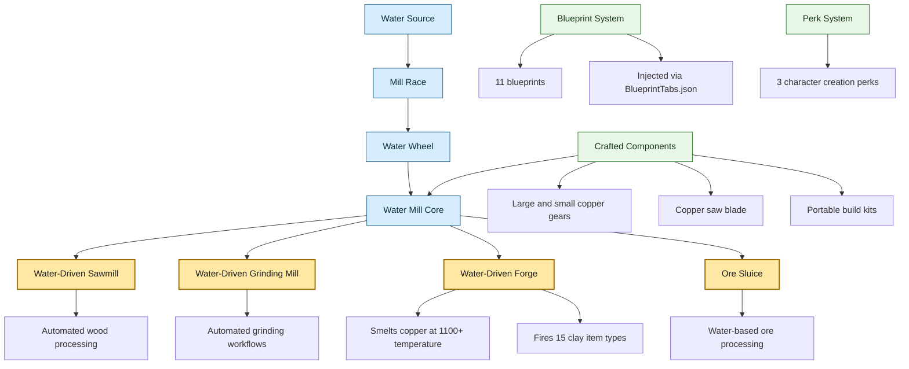

# Water Driven Infrastructure

**Version:** 1.2.2  
**Author:** Jared (crispywhips)  
**For:** Card Survival: Fantasy Forest (EA 0.62d)

---

## Overview

Water Driven Infrastructure adds large-scale water-powered construction to CSFF. Build water wheels, sawmills, forges, grinding mills, ore sluices, and more along rivers.

## WDI Feature Infographic

## Content

### Structures
- **Water Wheel** — powers other water-driven machines
- **Water Mill** — base milling structure
- **Mill Race** — channels water to power structures
- **Water-Driven Sawmill** — automated wood processing
- **Water-Driven Forge** — water-powered metalworking
- **Water-Driven Grinding Mill** — automated grinding
- **Ore Sluice** — water-based ore processing

### Crafted Components
- Copper Gear (Large & Small) — cast copper gears for machinery
- Copper Saw Blade — circular blade for the sawmill
- Various kit items for portable structure assembly

### Water-Driven Forge
- Smelts copper items (vanilla and mod) at 1100+ temperature
- Fires 15 clay item types (bowls, plates, pots, crucibles, etc.)
- Water-powered bellows for rapid heating
- Vanilla smelting recipes and mod recipes injected automatically by CSFFModFramework's SmeltingRecipeInjector

### Blueprints
11 blueprints across casting, construction, and assembly categories. Blueprints are injected into crafting tabs via `BlueprintTabs.json` (framework handles injection automatically).

### Perks
3 character creation perks for starting with pre-built infrastructure.

## Requirements

- BepInEx 5.x
- CSFFModFramework (latest)
- Card Survival: Fantasy Forest (EA 0.62d)

## Installation

1. Install BepInEx if not already installed
2. Install CSFFModFramework
3. Extract to `BepInEx/plugins/Water_Driven_Infrastructure/`
4. Launch game

## Status

v1.1.1. All systems functional: sawmill, forge (with kiln recipes), grinding mill, ore sluice, water wheel, mill race, copper components, 11 blueprints, 3 starting perks.

## Credits

- **Author:** Jared (crispywhips)
- **Framework:** CSFFModFramework + BepInEx & Harmony
- **Game:** Card Survival: Fantasy Forest by WinterSpring Games
